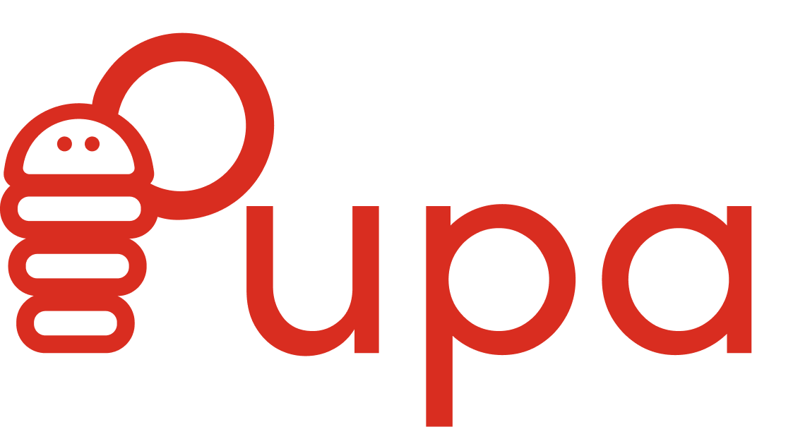
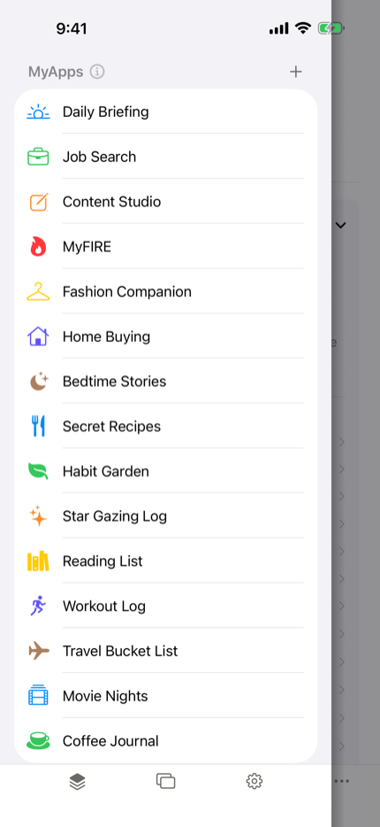
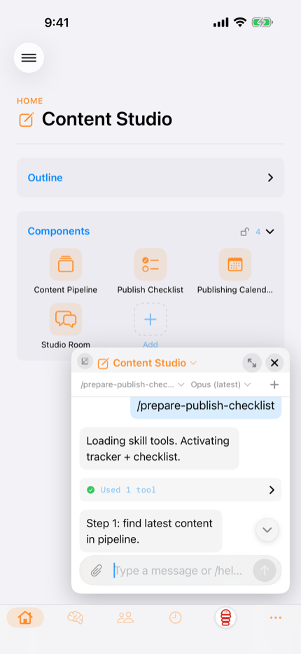
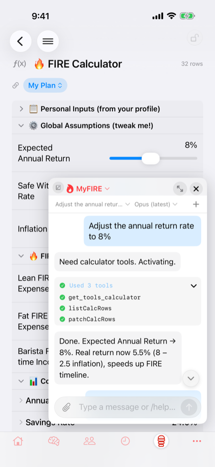

  

  <strong>Agentic experiences crystallised into real apps.</strong>
   
  <a href="https://pupa-app.com">pupa-app.com</a>

  
  

Pupa is a native iOS and macOS app where your agent builds you real apps.
Say what you need, and the canvas moulds into the shape that fits it:
trackers, calendars, checklists, charts, calculators, rooms of agents
talking to each other. Each one is a **MyApp**, with its own long-lived
Memories filesystem, so the work keeps growing instead of disappearing
when the chat ends.

The agent is yours. Pupa talks to a backend you run, fronting the harness
you already use (Claude Code works out of the box), so your keys and your
context stay on your machine.

|  One for everything you're juggling  |  Your agent builds you a real app  |  Just say what you need  |
| :---: | :---: | :---: |
|  |  |  |

## Build, use, share, contribute

- **Build** apps for anything, from daily helpers to full automations.
- **Use** them across your Apple devices, powered by the agent on your
  laptop, synced over iCloud.
- **Share** any app as a portable `.pupa` bundle, and install what others
  have made from the [marketplace](https://pupa-app.com/marketplace).
- **Contribute** the pieces themselves. Canvas shapes, MyApp templates and
  skills are all things you can add. See below.

## How it works

The app speaks plain [AG-UI](https://github.com/copilotkit/copilotkit) to
the [Pupa backend](https://github.com/pupa-app/pupa-backend) over a single
SSE stream. The backend runs wherever you want it, wraps your agent, and
forwards the client's tool definitions to the model. The model then drives
the canvas by calling those tools: the shapes render locally, the state
lives on device, and a MyApp exports as a self-contained `.pupa` bundle.

Two Swift packages sit behind that: `Pupa` (the app) and
[`AGUIKit`](AGUIKit/), a standalone AG-UI client for Apple platforms with
no dependency on Pupa, embeddable in any project.

## Get Pupa

**App Store: coming soon.** Email
[support@pupa-app.com](mailto:support@pupa-app.com) for a TestFlight
invite and try it early. One app covers iPhone, iPad and Mac — the invite
includes the Mac build, and a single Universal Purchase will cover all
three.

To build from source, see [CONTRIBUTING.md](CONTRIBUTING.md).

## Docs

| Doc | What |
|---|---|
| [architecture.md](docs/architecture.md) | How the app actually works. The source of truth. |
| [adding-a-component.md](docs/adding-a-component.md) | End to end recipe for a new canvas shape. |
| [marketplace.md](docs/marketplace.md) | `.pupa` bundle format, export and import, threat model. |
| [skills.md](docs/skills.md) | The per-MyApp `pupa/` folder: slash commands and playbooks. |
| [templates.md](docs/templates.md) | The realism bar for shipping a `.pupa` template. |
| [testing-turn-recovery.md](docs/testing-turn-recovery.md) | By-hand playbook for interrupted turns. |
| [components/](docs/components/) | Per-shape notes: [calculator](docs/components/calculator.md), [chart](docs/components/chart.md), [slack](docs/components/slack.md). |

## Contributing

Extending Pupa is the point. A canvas shape is a self-contained SwiftUI
view plus a typed model and its tools, so adding one is a small change
rather than surgery:
[docs/adding-a-component.md](docs/adding-a-component.md) walks the whole
recipe. MyApp templates and skills are plain files, no Swift required.

[CONTRIBUTING.md](CONTRIBUTING.md) covers setup, build and test commands,
the architecture tour, and the branch workflow (`dev` is the integration
branch). There is no CLA.

## License

| Path | License |
|---|---|
| `AGUIKit/` | [MIT](AGUIKit/LICENSE), so any Swift project can embed the AG-UI client, closed source included. |
| Everything else | [MPL-2.0](LICENSE). File-level copyleft: fixes to Pupa's files come back, and the app still ships on the App Store. |

Full terms in
[CONTRIBUTING.md](CONTRIBUTING.md#licensing-of-contributions).

Copyright © 2026 Pupa.
